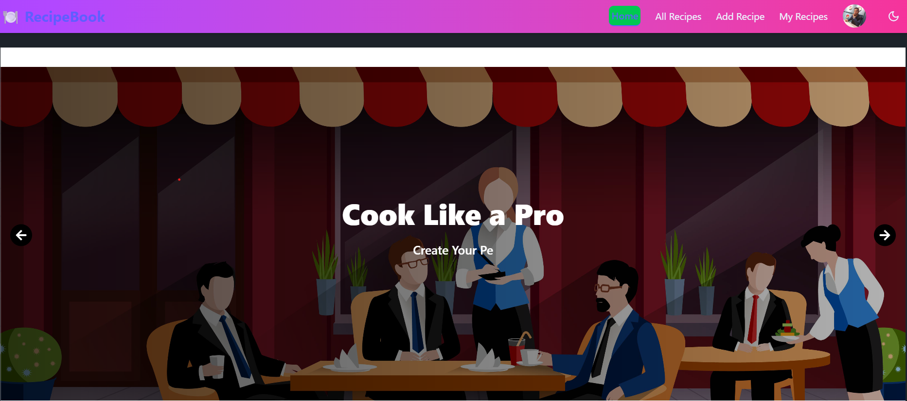

# Recipe Book

  
*A user-friendly platform to browse, view, order, bookmark, and add recipes.*

---

## 🚀 Project Overview  
Recipe Book lets users explore a variety of recipes, see detailed instructions, order ingredients, bookmark favorites, and contribute their own recipes. Built with React for the frontend and Node.js with Express for the backend, using MongoDB for storage.

---

## 🌐 Live Demo  
[View Live Project](https://recipe-book-b7df8.web.app/)

---

## 🛠️ Technologies Used  
- **Frontend:** React.js, Tailwind CSS  
- **Backend:** Node.js, Express.js  
- **Database:** MongoDB  
- **Tools:** Git, VS Code, REST APIs  

---

## ✨ Features  
- Browse and search recipes  
- View detailed recipe instructions  
- Order ingredients online  
- Bookmark favorite recipes  
- Add and share new recipes  

---

## ⚙️ Getting Started  

### Prerequisites  
- Node.js  
- MongoDB  

### Installation  

1. Clone the frontend repo:  
   ```bash
   git clone https://github.com/alamindev07/recipe-book-client.git
   cd recipe-book-client
   npm install
   npm start
